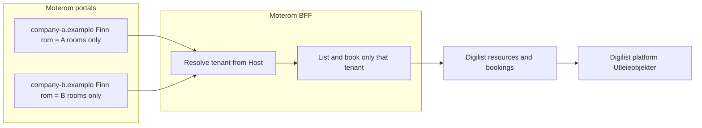

# Multi-tenant private portals (expansion contract)

Møterom scales to other companies as **private Digilist-backed building portals**, not as a second booking inventory and not as a shared marketplace catalogue.

## Product rule

Each company gets a private portal.

- **Finn rom**, bookings, calendar, messages, and admin for company A show **only** company A’s rooms.
- Company B’s rooms never appear on company A’s portal.
- Members of A cannot book B’s rooms through A’s hostname.
- Digilist platform **Utleieobjekter** may still list every tenant’s resources for Digilist ops. That is not Finn rom. Ops visibility must not be confused with customer catalogue isolation.

Isolation is a **tenant boundary**, not a UI filter after loading every company’s rooms.

## Architecture

| Piece                           | Owner    | Rule                                                                                                                              |
| ------------------------------- | -------- | --------------------------------------------------------------------------------------------------------------------------------- |
| Digilist tenant                 | Digilist | One tenant per company / building                                                                                                 |
| Room / utleieobjekt             | Digilist | `visibility=private`, `accessChannel=tenant_portal`, owned by that tenant                                                         |
| Bookings, membership, conflicts | Digilist | Authoritative                                                                                                                     |
| Portal UI + Express BFF         | Møterom  | Resolve tenant from hostname / configured origin; never trust a browser-supplied tenant id                                        |
| Room presentation overlay       | Møterom  | Photos, stable portal ids, copy — keyed to the Digilist tenant (today: single-tenant [`config/rooms.json`](../config/rooms.json)) |

## Current SKB deployment

Today Møterom is **single-tenant**: one `DIGILIST_TENANT_ID`, one `PUBLIC_ORIGIN`, one rooms map. That already enforces private Finn rom for SKB. See [`skb-private-portal.md`](skb-private-portal.md) and [`digilist-integration.md`](digilist-integration.md).

## When a second company exists

Do not start host-based multi-tenancy until a second real Digilist tenant and customer hostname exist.

Then:

1. **Tenant registry** — hostname → Digilist tenant id, building name, address, `ADMIN_EMAILS`, rooms overlay, access mode.
2. **Request binding** — every BFF call uses the tenant for that `Host`; session membership must match that tenant.
3. **Catalogue** — Finn rom lists only Digilist `tenant_portal` + private resources for the resolved tenant.
4. **Digilist platform** — label/filter Utleieobjekter by channel (Marketplace · Tenant portals · Pending) so ops can tell portal rooms from public rentals. That work lives in Digilist, not this repository.
5. Prefer **one multi-tenant Møterom deployment** with per-domain config once there are more than a few customers; one VPS per customer remains valid for early pilots.

## Non-goals

- A shared Finn rom that merges rooms from many companies
- Storing live Digilist bookings in Møterom SQLite
- Copying Digilist platform dashboard React into this public repository
- Trusting `tenantId` from the browser
- Dual-writing room masters into Møterom “so Digilist does not show them”

## Digilist platform note

Seeing SKB (or future portal) rooms under Digilist **Utleieobjekter** is expected: Digilist owns those resources. Private + `tenant_portal` keeps them off the public marketplace. Improving platform filters is Digilist product work and does not require changing Møterom’s booking authority model.
